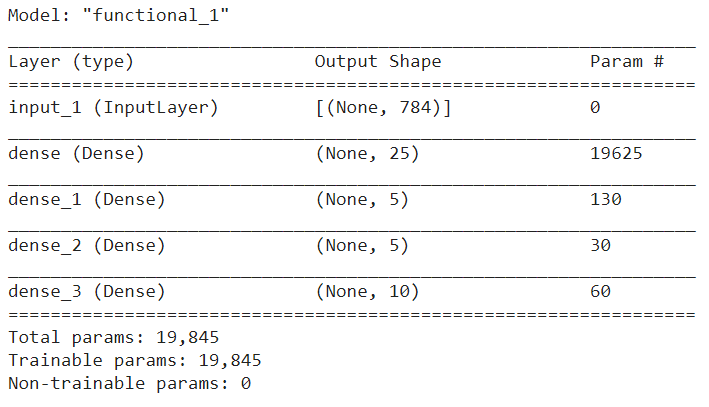
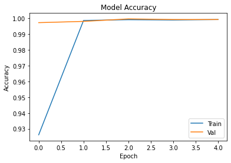
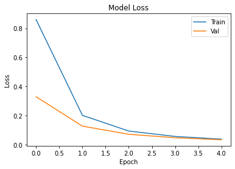

# Handwritten-Digits-Recognition
 
## Introduction
A machine learning project that uses python with TensorFlow library to create a neural network model for handwritten digits recognition.

## Dataset
The dataset used in this project is the MNIST digits classification dataset which is one of the Built-in small datasets in the Keras API.

This dataset contains 60,000 28x28 grayscale images of the 10 digits, along with a test set of 10,000 images. More info can be found on https://keras.io/api/datasets/mnist/.

## Model Structure

## Accuracy and Loss History

